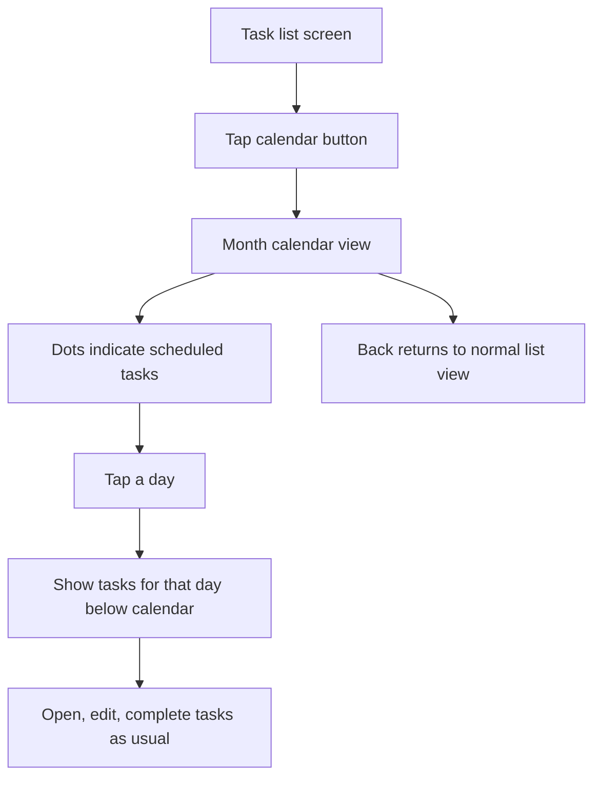

# Calendar Mode Requirements

## Problem Frame
Simpletask already understands scheduled task dates through `due:` and
`t:`/threshold fields, but the main experience is still list-first. That makes
it harder to browse work by date and quickly see which days already have
scheduled tasks without manually searching or filtering.

This feature adds a calendar-driven planning mode for people who use dated
tasks regularly. The goal is to make date-based browsing fast without turning
the app into a full calendar app or changing the todo.txt model.

## Requirements

**Entry and Navigation**
- R1. Add a calendar button to the main top bar next to the search action.
- R2. Tapping the calendar button opens a dedicated calendar mode rather than
  toggling the existing list screen in place.
- R3. While in calendar mode, pressing Back returns the user to the normal list
  view.
- R4. Calendar mode uses a monthly calendar as the primary navigation surface.
- R5. Entering calendar mode opens the current month, preselects today, and
  loads today's matching tasks in the list below.
- R6. Users can move between months by swiping horizontally.
- R7. Users can also open a month/year picker from the calendar header to jump
  directly to another month.

**Calendar Behavior**
- R8. Days with scheduled tasks show dot indicators in the month grid.
- R9. The definition of "scheduled task" is configurable in settings and
  supports `due:` dates, threshold `t:` dates, or both.
- R10. The default scheduled-task setting for new and upgraded users is to show
  both `due:` and `t:` dates.
- R11. Day cells stay minimal in v1: dot indicators only, with no counts or task
  text inside the month grid.
- R12. `Due:` and threshold dates use different dot colors so users can tell
  them apart at a glance.
- R13. If both date types are enabled, a task with both `due:` and threshold
  dates can contribute indicators on both dates.
- R14. Day cells must expose accessible labels that announce the date, whether
  the day is selected, and whether the day has due tasks, threshold tasks, or
  both.

**Day Selection and Task List**
- R15. Tapping a day shows the tasks scheduled exactly for that date in a list
  below the calendar on the same screen.
- R16. The day list excludes overdue items from other dates; the selected date
  is the only date-based inclusion rule in this mode.
- R17. Calendar mode ignores the user's current saved filters and query state;
  it acts on the full task set so the month view is a complete planning view.
- R18. Tasks shown below the calendar remain fully interactive, including normal
  task actions such as opening, editing, and completing tasks.
- R19. If the selected day has no matching tasks, the list area shows a clear
  empty state instead of staying blank.
- R20. Leaving calendar mode restores the user's prior main-list state,
  including query/filter state and scroll position.
- R21. On compact screens, the month grid remains visible at the top and the
  task list scrolls beneath it rather than replacing the calendar entirely.

## Success Criteria
- Users can open a month view from the main toolbar in one tap.
- Users can see which days have scheduled work without reading the full list.
- Users can tap a date and immediately work from that day's tasks.
- The feature improves date-based browsing and planning without changing the todo.txt task
  model or replacing the default list workflow.

## Scope Boundaries
- This feature does not add a weekly agenda, yearly view, or drag-and-drop
  calendar editing.
- This feature does not redefine overdue-task behavior outside calendar mode.
- This feature does not include quick switching between multiple todo files.
- This feature does not turn calendar mode into a filtered variant of the main
  search/query system.

## Key Decisions
- Calendar mode is a separate planning view: it should feel like a clear mode
  switch, not a small list embellishment.
- Scheduled-task visibility is configurable: users vary between due-date-only
  workflows and threshold-heavy workflows.
- Calendar mode ignores existing filters: the calendar should represent the full
  planning surface, not an accidental subset.
- Day cells use dots only: this keeps the month readable on small Android
  screens.
- `Due:` and threshold dates stay visually distinct: this preserves meaning
  even when both date types are enabled at once.
- Calendar mode restores the user's prior list state on exit: entering the
  planner should not discard where they were working before.

## Dependencies / Assumptions
- The existing task model for `due:` and threshold `t:` dates remains the source
  of truth for scheduled dates.
- The existing main task interaction model can be reused inside the day list.

## Outstanding Questions

### Deferred to Planning
- [Affects R1-R7][Technical] How should calendar mode fit into the current
  activity/fragment structure without adding brittle navigation state?
- [Affects R8-R21][Needs research] Which existing UI components or Android
  widgets can support a month grid cleanly in this codebase and SDK range?
- [Affects R9-R10][Technical] Where should the new scheduled-task mode setting
  live within the existing preferences structure?
- [Affects R12-R14][Technical] How should the month grid render dual-dot state
  accessibly and consistently on API 23+?
- [Affects R17-R20][Technical] How should calendar mode preserve or restore the
  user's previous list/query state and UI selection when they exit back to
  normal mode?

## Next Steps
Future follow-up: define a separate requirements doc for quick switching and
favoriting multiple todo files across local storage locations.

→ /prompts:ce-plan for structured implementation planning
