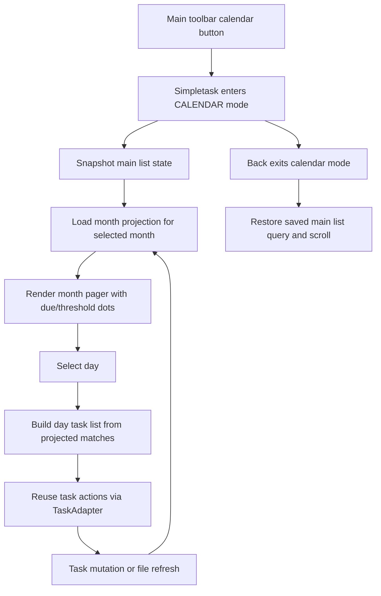

# feat: Add main-screen calendar mode

## Overview

Add a calendar planning mode to `Simpletask` that opens from the main toolbar,
shows a month grid with due/threshold indicators, and displays the selected
day's tasks below the grid. The implementation should stay inside the existing
`Simpletask` activity, reuse the current task model and task actions, and avoid
adding a second persisted query system.

## Problem Frame

The current app is list-first even though task dates already exist in the core
model (`due:` and `t:`). Users who plan from dates need a faster way to answer
"which days have scheduled work?" and then act on one day without losing their
place in the main list. The origin document defines calendar mode as a separate
planning surface with Back-based exit, today preselected on entry, dual dot
colors for due vs threshold dates, and full task interaction in the day list
(see origin: `docs/brainstorms/2026-04-03-calendar-mode-requirements.md`).

## Requirements Trace

- R1-R7. Add entry/navigation for a dedicated calendar mode from the main
  toolbar, including default entry state and month navigation.
- R8-R14. Show month-level scheduled-date indicators, with configurable date
  types and accessible day semantics.
- R15-R21. Show an interactive day list below the calendar, ignore the current
  saved query while in calendar mode, surface empty states, and restore the
  main list state on exit.
- Success criteria. Preserve the todo.txt model and the normal list workflow
  while adding a useful date-based planning surface.

## Scope Boundaries

- No weekly agenda, yearly view, drag-and-drop calendar editing, or calendar as
  the default home screen.
- No multi-file browsing or file favorites in this plan.
- No change to how dates are stored in tasks; the source of truth remains
  `Task.dueDate` and `Task.thresholdDate`.
- No change to existing filter semantics outside calendar mode.

## Context & Research

### Relevant Code and Patterns

- `app/src/main/java/nl/mpcjanssen/simpletask/Simpletask.kt` is the main UI
  owner for toolbar actions, menu inflation, drawers, FABs, task list wiring,
  and Back handling.
- `app/src/main/res/layout/main.xml` already contains one central content area
  that can host an alternate calendar+list container without changing the app
  shell.
- `app/src/main/res/menu/main.xml` is the correct insertion point for the new
  toolbar button.
- `app/src/main/java/nl/mpcjanssen/simpletask/task/TaskAdapter.kt` already
  renders interactive task rows and should be reused for the day list rather
  than inventing a second task-row UI.
- `app/src/main/java/nl/mpcjanssen/simpletask/util/Config.kt` is the standard
  place for persisted UI settings and scroll state.
- `app/src/main/java/nl/mpcjanssen/simpletask/Query.kt` and
  `app/src/main/java/nl/mpcjanssen/simpletask/task/TodoList.kt` show that the
  normal list query is globally persisted, so calendar mode must isolate its
  own working set rather than mutating `mainQuery`.
- `app/src/main/java/nl/mpcjanssen/simpletask/CalendarSync.kt` proves the app
  already treats due and threshold as separate date-bearing concepts, but it is
  sync-oriented rather than UI-oriented.

### Institutional Learnings

- There is no `docs/solutions/` corpus in this repo. The main repo-local source
  is the origin requirements doc.
- `app/src/main/assets/MYN.en.md` reinforces that threshold dates are planning
  dates used to defer/hide work, not the same concept as due dates. The UI
  should preserve that distinction.
- `app/src/main/assets/ui.en.md` shows existing filter behavior is deliberate.
  Calendar mode can bypass the saved query, but that should be explicit and
  isolated rather than accidentally reusing or overwriting filter state.

### External References

- Android `CalendarView` API reference:
  `https://developer.android.com/reference/android/widget/CalendarView`
  It is not a fit for per-day dual-dot rendering or an embedded split layout.
- Android ViewPager2 guidance:
  `https://developer.android.com/guide/navigation/advanced/swipe-view-2`
  Useful for a swipeable month container built from standard Android widgets.

## Key Technical Decisions

- Keep calendar mode inside `Simpletask`, not a separate activity.
  Rationale: the app already centralizes screen state, menus, and task
  interactions in one activity, and the requirements call for returning to the
  previous list state with Back rather than launching a new workflow.
- Add an explicit calendar display mode and a calendar-session snapshot.
  Rationale: `Config.mainQuery` is globally persisted; calendar mode needs its
  own transient state so opening the planner does not overwrite the user's
  normal list query, selection, or scroll.
- Persist calendar session state through `onSaveInstanceState`.
  Rationale: the feature requires deterministic restore after rotation or
  recreation, and the current activity does not have another restorable state
  model for selected month/day plus the pre-calendar list snapshot.
- Build the month grid in-repo with standard Android components.
  Rationale: there is no suitable existing widget in the repo, `CalendarView`
  is too limited for the required indicator/accessibility behavior, and adding
  a third-party calendar dependency would increase maintenance surface in an
  already aging codebase.
- Project scheduled dates through a dedicated domain helper before rendering.
  Rationale: month dots, selected-day lists, and mutation refreshes all need a
  shared definition of how due/threshold dates map into calendar cells.
- Define calendar mode as a "full planning set" over the current todo file, not
  over the saved query.
  Rationale: the requirements explicitly say calendar mode ignores saved
  filters/query state. The implementation should therefore bypass
  `Query.applyFilter()` for project/list/search filters while using one
  dedicated inclusion rule for both indicators and the day list.
- Reuse `TaskAdapter` for the day list, but back it with a calendar-specific
  in-memory query/view model.
  Rationale: the row UI and task actions already exist; the risky part is query
  isolation, not row rendering.

## Open Questions

### Resolved During Planning

- How should calendar mode fit into the app structure?
  Resolution: implement it as a new mode inside `Simpletask` plus an alternate
  content container in `main.xml`.
- What month-navigation strategy should back the UI?
  Resolution: use a swipeable month pager plus a month/year picker from the
  calendar header.
- How should the month grid be implemented?
  Resolution: use a custom in-repo month pager built from `ViewPager2` and a
  month-cell adapter rather than `CalendarView` or a third-party calendar UI.
- How should due and threshold indicators behave?
  Resolution: keep them visually distinct, allow both to appear when both modes
  are enabled, and use a single projection helper so dots and day-list contents
  stay consistent.

### Deferred to Implementation

- Exact view class split between `Simpletask`, a calendar controller/helper,
  and the month/day adapters.
  Why deferred: this depends on how much code can be kept inside the existing
  activity without making `Simpletask.kt` worse than it already is.

## High-Level Technical Design

> *This illustrates the intended approach and is directional guidance for
> review, not implementation specification. The implementing agent should treat
> it as context, not code to reproduce.*

## Implementation Units

- [ ] **Unit 1: Add calendar mode state and persisted settings**

**Goal:** Introduce the minimum state model needed to enter/exit calendar mode
without corrupting the existing main-list query and scroll state.

**Requirements:** R1-R3, R5, R9-R10, R17-R20

**Dependencies:** None

**Files:**
- Modify: `app/src/main/java/nl/mpcjanssen/simpletask/Simpletask.kt`
- Modify: `app/src/main/java/nl/mpcjanssen/simpletask/util/Config.kt`
- Modify: `app/src/main/res/values/donottranslate.xml`
- Modify: `app/src/main/res/values/strings.xml`
- Modify: `app/src/main/res/xml/interface_preferences.xml`
- Create: `app/src/main/java/nl/mpcjanssen/simpletask/calendar/CalendarModeState.kt`
- Test: `app/src/test/java/nl/mpcjanssen/simpletask/calendar/CalendarModeStateTest.kt`

**Approach:**
- Add a persisted setting for scheduled-date visibility (`due`, `threshold`,
  `both`) using the existing `Config`/preferences pattern.
- Add a transient calendar-session snapshot model that captures the pre-calendar
  list query, scroll position, and selection state. Keep this out of
  `Config.mainQuery` so opening calendar mode does not reset the normal list.
- Gate existing main-list scroll persistence in `Simpletask.onPause()` so
  calendar-mode pauses do not overwrite `Config.lastScrollPosition` or
  `Config.lastScrollOffset`.
- Extend mode handling in `Simpletask` conceptually to include a calendar
  display state instead of treating calendar mode as a drawer or filter state.

**Patterns to follow:**
- `app/src/main/java/nl/mpcjanssen/simpletask/util/Config.kt`
- `app/src/main/java/nl/mpcjanssen/simpletask/Query.kt`
- `app/src/main/java/nl/mpcjanssen/simpletask/FilterActivity.kt`

**Test scenarios:**
- Happy path: persisted scheduled-date setting round-trips through `Config`.
- Edge case: entering calendar mode from a filtered/scrolled list preserves the
  snapshot even if the user immediately exits.
- Edge case: entering calendar mode with selected tasks preserves or explicitly
  clears selection according to the chosen mode contract.
- Error path: invalid or missing stored scheduled-date preference falls back to
  the default `both` behavior.

**Verification:**
- Calendar mode can be entered and exited without mutating the user's saved
  main query or destroying the stored main-list scroll position.

- [ ] **Unit 2: Add calendar date projection helpers**

**Goal:** Centralize how tasks map to month indicators and selected-day task
lists so all calendar rendering and refresh behavior share one definition.

**Requirements:** R8-R16, R19

**Dependencies:** Unit 1

**Files:**
- Create: `app/src/main/java/nl/mpcjanssen/simpletask/calendar/CalendarTaskProjector.kt`
- Create: `app/src/main/java/nl/mpcjanssen/simpletask/calendar/CalendarDayModel.kt`
- Modify: `app/src/main/java/nl/mpcjanssen/simpletask/task/TodoList.kt`
- Modify: `app/src/main/java/nl/mpcjanssen/simpletask/util/Util.kt`
- Test: `app/src/test/java/nl/mpcjanssen/simpletask/calendar/CalendarTaskProjectorTest.kt`

**Approach:**
- Add a projection helper that consumes the current todo file's tasks and the
  scheduled-date visibility mode, then returns:
  - month-level indicator data per date
  - selected-day task matches
  - empty-state metadata
- Keep the projector independent of Android views so most behavior can be
  verified with JVM tests.
- Bypass `Query.applyFilter()` for calendar data. Calendar mode should ignore
  saved search/project/list filters while using one explicit inclusion contract
  for both dots and the day list:
  - include tasks from the current todo file only
  - exclude hidden placeholder tasks by default
  - exclude completed tasks by default
  - include future tasks when they match the selected scheduled-date mode
- Treat tasks with both due and threshold dates as contributing to both dates
  when both types are enabled, while each selected day only shows tasks matching
  that exact day/date type combination once.

**Patterns to follow:**
- `app/src/main/java/nl/mpcjanssen/simpletask/task/TodoList.kt`
- `app/src/main/java/nl/mpcjanssen/simpletask/util/Util.kt`
- `app/src/main/java/nl/mpcjanssen/simpletask/CalendarSync.kt`

**Test scenarios:**
- Happy path: a due-only task appears on its due date and in that day's list.
- Happy path: a threshold-only task appears on its threshold date and in that
  day's list when threshold visibility is enabled.
- Happy path: a task with both due and threshold dates produces indicators for
  both dates when mode is `both`.
- Edge case: selecting a day with no matches returns an explicit empty state.
- Edge case: hidden/completed/future-task behavior matches the plan's calendar
  contract rather than the saved `mainQuery`.
- Error path: malformed or unparseable date strings are ignored without
  crashing projection for the rest of the month.
- Integration: after a task date mutation, re-running projection updates both
  the old and new dates consistently.

**Verification:**
- Month dots and day-list membership can be derived deterministically from the
  current task set without reading UI state.

- [ ] **Unit 3: Wire calendar mode into the main activity shell**

**Goal:** Add the toolbar entry point, Back handling, central-content swap, and
session restore logic inside `Simpletask`.

**Requirements:** R1-R7, R17-R21

**Dependencies:** Unit 1, Unit 2

**Files:**
- Modify: `app/build.gradle`
- Modify: `app/src/main/java/nl/mpcjanssen/simpletask/Simpletask.kt`
- Modify: `app/src/main/res/layout/main.xml`
- Modify: `app/src/main/res/menu/main.xml`
- Modify: `app/src/main/res/values/strings.xml`
- Test: `app/src/androidTest/java/nl/mpcjanssen/simpletask/CalendarModeNavigationTest.kt`
- Create: `app/src/androidTest/java/nl/mpcjanssen/simpletask/CalendarTestSupport.kt`

**Approach:**
- Add the calendar action to `app/src/main/res/menu/main.xml` next to existing
  toolbar actions and handle it in `Simpletask.onOptionsItemSelected`.
- Extend mode handling so `onCreateOptionsMenu`, `onBackPressed`, and the
  existing `UiHandler` can distinguish list mode from calendar mode.
- Add an alternate content container to `main.xml` that keeps the month grid
  visible above a dedicated day-list `RecyclerView`.
- Snapshot the current list state on entry and restore it on exit, while still
  allowing underlying task changes made during calendar mode to show up after
  return.
- Save and restore calendar session state in `onSaveInstanceState`, including
  whether calendar mode is active, the visible month, selected day, and the
  pre-calendar list snapshot needed for Back restore.
- Add explicit calendar-mode branches for the existing `UiHandler`/broadcast
  refresh events so tasklist updates, resume flows, and filter-related events
  refresh the calendar surface instead of repopulating the main list path.
- Add the missing `androidx.viewpager2:viewpager2` dependency and a minimal
  `androidTest` scaffold so the navigation/state scenarios in this plan are
  actually runnable.

**Patterns to follow:**
- `app/src/main/java/nl/mpcjanssen/simpletask/Simpletask.kt`
- `app/src/main/res/layout/main.xml`
- `app/src/main/res/menu/main.xml`

**Test scenarios:**
- Happy path: tapping the toolbar button opens calendar mode with the current
  month and today preselected.
- Happy path: Back exits calendar mode and restores the prior list query and
  scroll state.
- Edge case: opening calendar mode from a filtered/searched list does not
  overwrite `Config.mainQuery`.
- Edge case: rotation or activity recreation while in calendar mode restores
  the selected month/day and still exits back to the original list state.
- Integration: tasklist change broadcasts while calendar mode is visible
  refresh the calendar view instead of dropping back to list mode.

**Verification:**
- Users can enter/exit calendar mode from the existing main screen without
  losing their place in the normal list.

- [ ] **Unit 4: Build the month pager and accessible day cells**

**Goal:** Render a swipeable month UI with month/year picker support, dual dot
colors, selection semantics, and compact-screen behavior.

**Requirements:** R4, R6-R14, R21

**Dependencies:** Unit 2, Unit 3

**Files:**
- Create: `app/src/main/java/nl/mpcjanssen/simpletask/calendar/CalendarMonthPagerAdapter.kt`
- Create: `app/src/main/java/nl/mpcjanssen/simpletask/calendar/CalendarMonthCellAdapter.kt`
- Create: `app/src/main/res/layout/calendar_mode.xml`
- Create: `app/src/main/res/layout/calendar_month_page.xml`
- Create: `app/src/main/res/layout/calendar_day_cell.xml`
- Modify: `app/src/main/res/values/colors.xml`
- Modify: `app/src/main/res/values/strings.xml`
- Test: `app/src/androidTest/java/nl/mpcjanssen/simpletask/calendar/CalendarMonthUiTest.kt`

**Approach:**
- Use `ViewPager2` for horizontal month swiping and a custom header control for
  month/year jumping.
- Keep the month grid lightweight: day number plus dot region only.
- Add due-dot and threshold-dot colors with accessible content descriptions so
  TalkBack can announce what each day contains.
- When month navigation lands on a month that lacks the previously selected day
  number, clamp selection to the last valid day of the target month, refresh
  the day list for that clamped date, and announce the adjusted selection.
- Define keyboard and D-pad behavior explicitly: header controls are focusable,
  day cells support directional navigation, and Enter/center-key activation
  selects the focused day.
- Keep the month grid visible at the top on compact screens and let the day
  list scroll below it. In short-height layouts, preserve at least one full row
  of week cells plus the header before the day list takes the remaining space.

**Patterns to follow:**
- `app/src/main/res/layout/main.xml`
- `app/src/main/java/nl/mpcjanssen/simpletask/AddTask.kt`
- `app/src/main/java/nl/mpcjanssen/simpletask/util/Config.kt`

**Test scenarios:**
- Happy path: swiping changes the visible month and refreshes indicators.
- Happy path: the month/year picker jumps across year boundaries correctly.
- Edge case: selected-day behavior remains deterministic when the user moves to
  a month that does not contain the previously selected day number by clamping
  to the last valid day in the target month.
- Edge case: days with due-only, threshold-only, both, and no tasks render the
  correct indicator state.
- Error path: accessibility labels still announce a usable description when a
  day has both dot types or no tasks.
- Integration: keyboard/D-pad navigation can move through the header, month
  grid, and day list without trapping focus.
- Integration: compact-screen layout keeps the month grid visible while the day
  list remains scrollable.

**Verification:**
- The month UI is navigable, compact, and understandable without reading task
  text inside the grid.

- [ ] **Unit 5: Reuse task interactions in the calendar day list**

**Goal:** Make the selected-day list fully interactive and keep month/day data
in sync when tasks are edited, completed, deferred, or deleted.

**Requirements:** R15-R21

**Dependencies:** Unit 2, Unit 3, Unit 4

**Files:**
- Modify: `app/src/main/java/nl/mpcjanssen/simpletask/Simpletask.kt`
- Modify: `app/src/main/java/nl/mpcjanssen/simpletask/task/TaskAdapter.kt`
- Modify: `app/src/main/java/nl/mpcjanssen/simpletask/AddTask.kt`
- Modify: `app/src/main/java/nl/mpcjanssen/simpletask/task/TodoList.kt`
- Test: `app/src/androidTest/java/nl/mpcjanssen/simpletask/calendar/CalendarDayListInteractionTest.kt`
- Test: `app/src/test/java/nl/mpcjanssen/simpletask/calendar/CalendarMutationRefreshTest.kt`

**Approach:**
- Back the day list with its own adapter instance so calendar interactions do
  not overwrite the main list's current adapter/query state.
- Reuse existing task actions (complete, uncomplete, defer, edit, delete) and
  refresh calendar projections immediately after any mutation or broadcast.
- Keep the selected calendar month/day stable after returning from `AddTask` or
  after in-place mutations unless the requirements explicitly force a different
  target day.

**Patterns to follow:**
- `app/src/main/java/nl/mpcjanssen/simpletask/task/TaskAdapter.kt`
- `app/src/main/java/nl/mpcjanssen/simpletask/task/TodoList.kt`
- `app/src/main/java/nl/mpcjanssen/simpletask/AddTask.kt`

**Test scenarios:**
- Happy path: selecting a day shows interactive task rows that can be opened,
  edited, completed, and deferred.
- Happy path: completing or deleting the last task for a day transitions to the
  empty state and updates month indicators.
- Edge case: editing a task moves it from one date to another and refreshes both
  affected dates.
- Edge case: a task with both due and threshold dates updates both indicator
  dates consistently when one date is changed.
- Error path: returning from add/edit after a task move preserves calendar mode
  and does not dump the user back into list mode.
- Integration: exiting calendar mode after mutations restores the original list
  query/scroll while reflecting updated task data.

**Verification:**
- Calendar mode is a real working surface, not a read-only summary.

## System-Wide Impact

- **Interaction graph:** `Simpletask` menu handling, Back handling, `UiHandler`,
  `TodoList` broadcasts, `TaskAdapter` interactions, and `AddTask` return flow
  all participate in calendar mode.
- **Error propagation:** invalid dates or unsupported calendar-render states
  should degrade by omitting indicators for that task/date, not by failing the
  whole month or crashing the main screen.
- **State lifecycle risks:** main-list query corruption, stale month indicators
  after mutations, and leaked selection state are the main risks.
- **API surface parity:** no external API changes; this is an internal UI mode
  layered on existing task operations.
- **Integration coverage:** UI tests need to cover Back restore, mutation
  refresh, rotation/recreation, and month navigation because unit tests alone
  will not prove those flows.
- **Unchanged invariants:** task storage, todo-file format, existing filter
  behavior outside calendar mode, and current date-editing dialogs stay intact.

## Risks & Dependencies

| Risk | Mitigation |
|------|------------|
| `Simpletask.kt` becomes even more overloaded | Isolate calendar state/projection logic into `calendar/` helpers and keep activity changes focused on wiring |
| Custom month grid introduces UI complexity | Keep the first version minimal: number + dual dots, no counts, no extra row content |
| Calendar mode accidentally overwrites saved query state | Use a dedicated snapshot object and never persist calendar-specific filtering through `Config.mainQuery` |
| Mutation flows leave stale indicators | Recompute projection from the current task list after every tasklist-changed broadcast and direct task mutation |
| Accessibility regresses with dot-only cells | Define content descriptions and selected-state announcements as first-class requirements and test them in the UI layer |

## Documentation / Operational Notes

- Update in-app help only if the feature ships in a user-visible release; the
  likely target is `app/src/main/assets/ui.en.md`.
- Add new strings for the toolbar action, empty state, scheduled-date mode
  labels, and accessibility descriptions.
- No rollout infrastructure or migration is required because this feature only
  adds UI and preferences on top of the existing task model.

## Sources & References

- **Origin document:** `docs/brainstorms/2026-04-03-calendar-mode-requirements.md`
- Related code: `app/src/main/java/nl/mpcjanssen/simpletask/Simpletask.kt`
- Related code: `app/src/main/java/nl/mpcjanssen/simpletask/task/TaskAdapter.kt`
- Related code: `app/src/main/java/nl/mpcjanssen/simpletask/util/Config.kt`
- Related code: `app/src/main/java/nl/mpcjanssen/simpletask/CalendarSync.kt`
- External docs: `https://developer.android.com/reference/android/widget/CalendarView`
- External docs: `https://developer.android.com/guide/navigation/advanced/swipe-view-2`
